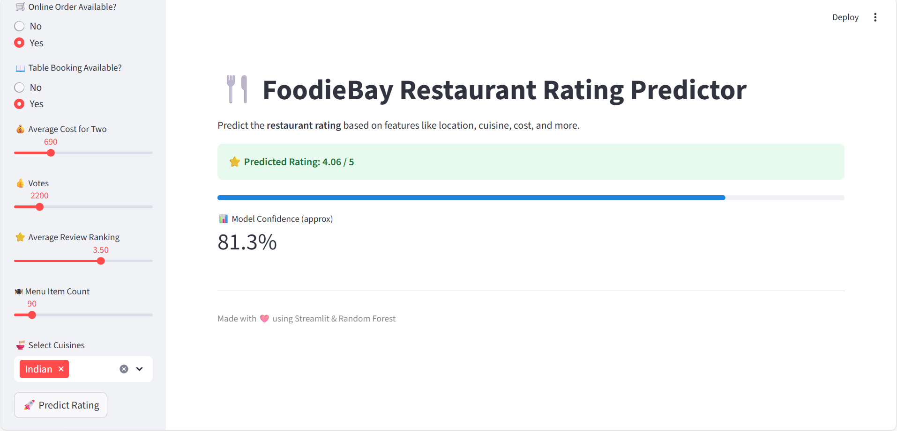

🍴 FoodieBay Restaurant Rating Predictor

An interactive Streamlit app that predicts restaurant ratings for FoodieBay restaurants based on multiple factors like location, restaurant type, cuisine, votes, cost, etc.

This project uses a Random Forest model trained on the FoodieBay dataset.

🚀 Features

📍 Select Location, Restaurant Type, Listed Type, Listed City
(Dropdown menus populated from dataset categories)

🛒 Online Order: Yes / No

📖 Table Booking: Yes / No

💰 Average Cost for Two: Adjustable slider

👍 Votes: Adjustable slider

⭐ Average Review Ranking: Adjustable slider

🍽 Menu Item Count: Adjustable slider

🍜 Cuisines: Multi-select options from full cuisine list

📊 Output:

Predicted rating score (/5)

Confidence %

Progress bar visualization

cls

🛠 Installation & Setup
1️⃣ Clone the repo
git clone https://github.com/yourusername/foodiebay-rating-predictor.git
cd foodiebay-rating-predictor

2️⃣ Create virtual environment
python -m venv venv
source venv/bin/activate    # Linux/Mac
venv\Scripts\activate       # Windows

3️⃣ Install dependencies
pip install -r requirements.txt

📌 Example requirements.txt:

streamlit
pandas
numpy
scikit-learn

4️⃣ Run the app
streamlit run app.py

🎮 Usage Guide

When you open the app in browser:

Sidebar Input Panel

Select location, restaurant type, listed type, listed city from dropdowns

Toggle Online Order & Table Booking (Yes/No)

Adjust sliders for cost, votes, review ranking, menu items

Choose multiple cuisines

Prediction

Click 🚀 Predict Rating

See predicted restaurant rating (/5) with confidence

🔗 Notes

If your foodiebay_cleaned.csv only has numeric codes, make sure you keep a mapping dictionary from numeric → actual names (e.g., "0 → BTM Layout") so dropdowns can show readable names.

Model is trained using Random Forest, but you can replace it with any ML model.

📸 Demo Screenshot (example)

❤️ Credits

Dataset: FoodieBay Restaurant Dataset

Built with: Python, Pandas, Scikit-learn, Streamlit